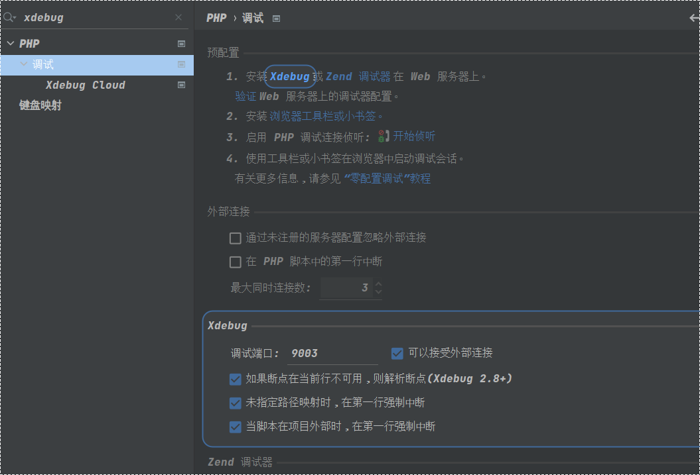
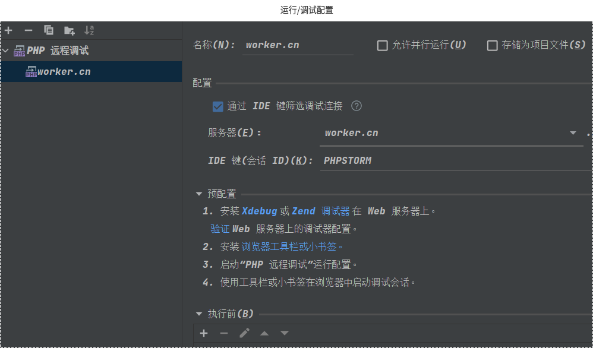
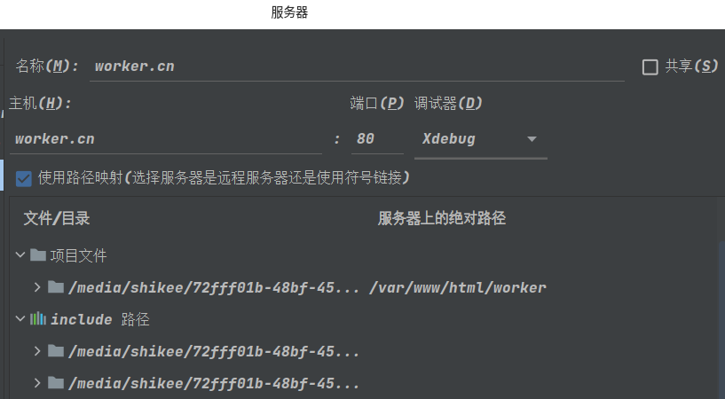

> 配置一



设置 >> 调试

查看Xdebug调试端口，端口号和php.ini中的xdebug配置一致：

```
xdebug3配置：

xdebug.client_port = 9003
xdebug.client_host = 172.24.0.1

xdebug2配置：
xdebug.remote_host = 172.24.0.1
xdebug.remote_port = 9003
```

> 配置二



运行/调试配置

注意添加配置为：php远程调试

会话ID填写值与配置一致:

xdebug.idekey = PHPSTORM

> 配置三



服务配置：

主机：访问主域名

勾选使用路径映射

文件/目录：本地站点绝对路径

服务器上的绝对路径： 站点所在docker环境php容器内的绝对路径