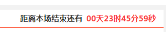

### 使用方法

```
<script type="text/javascript" src="vendor/timedown.js"></script>
<script type="text/javascript">
$(function () {
    //本场活动状态
    $('.activity-status').timedown({
        dateLeft: "\<span\>距离本场结束还有\<\/span\>"
    });
});
</script>


<div class="activity-status" data-start-time="1579239689"></div>

```

### 效果


