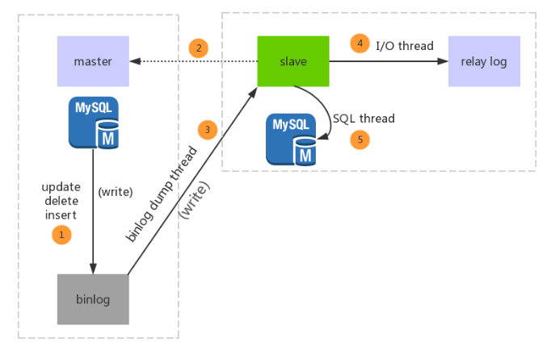

#### 原理

- 主从同步是异步复制的过程，Master上开启bin-log日志（记录数据库增、删除、修改、更新操作）；

- Slave开启I/O线程来请求Master服务器，请求指定bin-log中position点之后的内容；

- Master端收到请求，Master端I/O线程响应请求，bin-log、position之后内容返给Salve；

- Slave将收到的内容存入relay-log中继日志中，生成master.info（记录Master ip、bin-log、position、用户名密码）；

- Slave端SQL实时监测relay-log日志有更新，解析更新的sql内容，解析成sql语句，再Salve库中执行；



1.主库的更新事件(update、insert、delete)被写到binlog

2.从库启动并向主库发起连接

3.主库创建一个binlog dump thread线程把binlog的内容发送到从库

4.从库启动之后会创建一个I/O线程和一个SQL线程，I/O线程负责读取主库传过来的binlog内容并写入到relay log，SQL线程负责从relay log里面读取内容，从Exec_Master_Log_Pos位置开始执行读取sql写入到数据库

参考：

https://blog.csdn.net/qq_40907977/article/details/90301805

#### 主数据库服务器配置

进入主数据库服务器配置目录打开my.ini或conf.d目录的配置文件,在文件末尾增加如下配置：

```
#数据库ID号， 为1时表示为Master,其中master_id必须为1到232–1之间的一个正整数值; 
server-id = 1

#启用二进制日志；
log-bin=mysql-bin

#需要同步的二进制数据库名；
binlog-do-db=demo

#不同步的二进制数据库名,如果不设置可以将其注释掉;
binlog-ignore-db=information_schema
binlog-ignore-db=mysql
binlog-ignore-db=personalsite
binlog-ignore-db=test

#启用二进制日志；
log-bin=mysql-bin 

#把更新的记录写到二进制文件中，主主复制需要开启，默认关闭，只有一个主库的可以注释掉；
log-slave-updates=1
```

重启主库：
```
service mysql restart
```

授予用户 slave REPLICATION SLAVE权限和REPLICATION CLIENT权限，用于在主从库之间同步数据

```
mysql>CREATE USER 'slave'@'172.24.0.5' IDENTIFIED BY '123456';
mysql>GRANT REPLICATION SLAVE, REPLICATION CLIENT on demo.* to slave@172.24.0.5;
mysql>flush privileges;

```

查看 master 状态
```
mysql>show master status;
```

记下File以及Position的值，在后面进行从服务器操作的时候需要使用

#### 从数据库服务器配置

进入从数据库服务器配置目录打开my.ini或conf.d目录的配置文件,在文件末尾增加如下配置：

```
#数据库ID号；
server-id = 2  
#开启二进制日志功能，用于作为其他slave的master使用
log-bin=mysql-bin

#主库host
master-host=172.24.0.4

#在主数据库服务器中建立的用于该从服务器备份使用的用户
master-user = slave
master-password = 123456
master-port = 3306

#如果发现主服务器断线，重新连接的时间差；
master-connect-retry=60

#不需要备份的数据库； 
replicate-ignore-db=mysql

#需要备份的数据库
replicate-do-db=demo

#把更新的记录写到二进制文件中，主主复制需要开启，默认关闭，只有一个主库的可以注释掉；
log-slave-updates=1
```

进入从数据库服务器，启动Slave

配置主从同步

```
mysql>change master to master_host='172.24.0.4',master_user='root',master_password='root',master_log_file='mysql-bin.000001' ,master_log_pos=154;

mysql>start slave;

mysql>show slave status\G;

```

Slave_IO_Running进程以及Slave_SQL_Running进程都必须正常运行

```
mysql> show slave status\G;
*************************** 1. row ***************************
               Slave_IO_State: Waiting for master to send event
                  Master_Host: 192.168.0.101
                  Master_User: root
                  Master_Port: 3306
                Connect_Retry: 60
              Master_Log_File: mysql-bin.000001
          Read_Master_Log_Pos: 1393
               Relay_Log_File: 192-relay-bin.000005
                Relay_Log_Pos: 1284
        Relay_Master_Log_File: mysql-bin.000001
             Slave_IO_Running: Yes
            Slave_SQL_Running: Yes
              Replicate_Do_DB: 
          Replicate_Ignore_DB: 
           Replicate_Do_Table: 
       Replicate_Ignore_Table: 
      Replicate_Wild_Do_Table: 
  Replicate_Wild_Ignore_Table: 
                   Last_Errno: 0
                   Last_Error: 
                 Skip_Counter: 0
          Exec_Master_Log_Pos: 1393
              Relay_Log_Space: 1930
              Until_Condition: None
               Until_Log_File: 
                Until_Log_Pos: 0
           Master_SSL_Allowed: No
           Master_SSL_CA_File: 
           Master_SSL_CA_Path: 
              Master_SSL_Cert: 
            Master_SSL_Cipher: 
               Master_SSL_Key: 
        Seconds_Behind_Master: 0
Master_SSL_Verify_Server_Cert: No
                Last_IO_Errno: 0
                Last_IO_Error: 
               Last_SQL_Errno: 0
               Last_SQL_Error: 
  Replicate_Ignore_Server_Ids: 
             Master_Server_Id: 101
                  Master_UUID: 220919a2-9690-11e6-9c9b-9d406b577440
             Master_Info_File: /usr/local/var/mysql/master.info
                    SQL_Delay: 0
          SQL_Remaining_Delay: NULL
      Slave_SQL_Running_State: Slave has read all relay log; waiting for more updates
           Master_Retry_Count: 86400
                  Master_Bind: 
      Last_IO_Error_Timestamp: 
     Last_SQL_Error_Timestamp: 
               Master_SSL_Crl: 
           Master_SSL_Crlpath: 
           Retrieved_Gtid_Set: 
            Executed_Gtid_Set: 
                Auto_Position: 0
         Replicate_Rewrite_DB: 
                 Channel_Name: 
           Master_TLS_Version: 
1 row in set (0.00 sec)

ERROR: 
No query specified


```