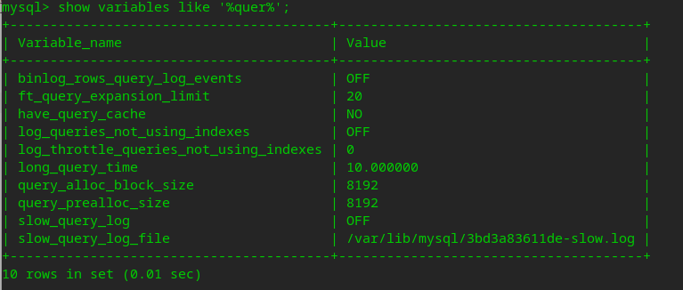
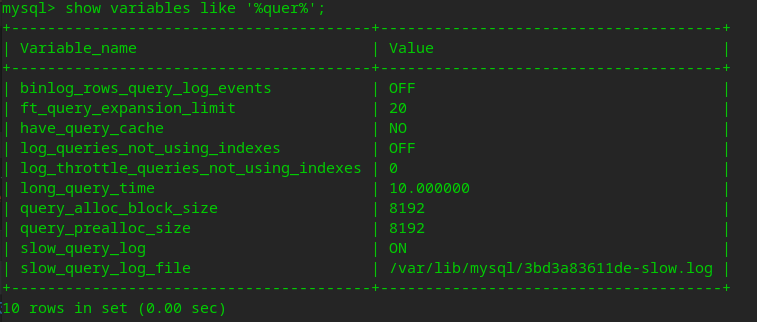

#### 说明

当语句执行时间较长时，通过日志的方式进行记录，这种方式就是慢查询的日志

慢查询日志规则可以临时配置，也可以永久写入配置文件

- 查看当前配置



- 临时开启慢查询日志
```
#开启
set global slow_query_log = on; 

#关闭
set global slow_query_log = off; 
```
- 临时设置慢查询时间临界点

设置超过10s的查询都将被记录到慢查询
```
set global long_query_time = 10;
```

- 设置慢查询存储的方式

日志以文件形式保存，默认是 none，我们可以设置为 table 或者 file，如果是 table 则慢查询信息会保存到mysql.slow_log表中
```
set global log_output = file;
```

文件路径，系统默认给一个缺省的文件 host_name-slow.log
```
set global slow_query_log_file='/data/mysql/mysql-slow.log'
```

查看配置项
```
show variables like '%log_output%';
```

- 配置文件方式
```
[mysqld]
slow_query_log = on
long_query_time = 10
log_output = file
slow_query_log_file=/data/mysql/mysql-slow.log
```

- 查看慢查询相关配置
```
show variables like '%quer%';
```



参数说明:
```
slow_query_log : 是否已经开启慢查询
slow_query_log_file : 慢查询日志文件路径
long_query_time :  超过多少秒的查询就写入日志 
log_queries_not_using_indexes 如果值设置为ON，则会记录所有没有利用索引的查询(性能优化时开启此项,平时不要开启)
```

- 对慢查询日志进行分析

使用 mysql 安装后就自带的工具 mysqldumpslow
例如：

```
#显示出慢查询日志中最慢的10条sql
mysqldumpslow -t 10  /data/mysql/mysql-slow.log;  
```

使用功能较多的 pt-query-digest 工具进行分析

- set global 与 set 的区别

set 只针对当前会话，set global 针对全部会话，但重启 mysql 后会失效