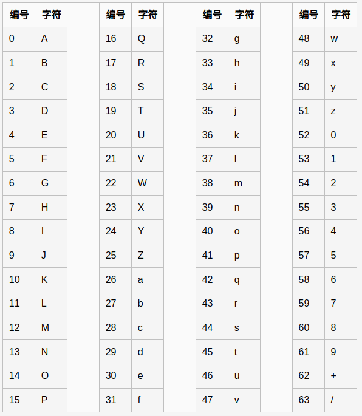

#### 基础

Base64是常见的一种用于传输8Bit字节代码的编码方式，Base64要求把每三个8Bit的字节转换为四个6Bit的字节（3*8 = 4*6 = 24），然后把6Bit再添两位高位0，组成四个8Bit的字节

在Base64中的可打印字符包括字母A-Z、a-z、数字0-9 ，这样共有62个字符，此外两个可打印符号在不同的系统中一般有所不同。但是，我们经常所说的Base64另外2个字符是：“+/”



如果最后剩下两个输入数据，在编码结果后加1个“=”；如果最后剩下一个输入数据，编码结果后加2个“=；如果没有剩下任何数据，就什么都不要加，这样才可以保证资料还原的正确性

也就是说，转换后的字符串理论上将要比原来的长1/3，编码结果格式是大小写字母、数字、“=”号、“+”号和“/”号，但“=”等号最多只有两个

例如：
```
echo base64_encode("https://www.baidu.com/");
# aHR0cHM6Ly93d3cuYmFpZHUuY29tLw==
```

所以看到有大小写字母的字符串并且有一个或两个等号结束的，基本可以判断是base64编码

如果URL中有“+“符号会解析错误（加号被替换成空格））：
```
http://localhost/jwt/demo.php?name=a+b

echo $name = $_GET['name'];
var_dump($name);

结果为：
a bstring(3) "a b" 
```

#### 编码安全

base64不适合直接放在URL里作为参数传输,发现base64编码中有“/” “+”符号。为解决此问题，可采用一种用于URL的改进Base64编码，它不在末尾填充'='号，并将标准Base64中的“+”和“/”分别改成了“_”和“-”，这样就免去了在URL编解码和数据库存储时所要作的转换

- 先将内容编码成Base64结果
- 将结果中的加号”+”替换成中划线“-“
- 将结果中的斜杠”/”替换成下划线”_”
- 将结果中尾部的“=”号全部保留

编码：
```
public static function urlsafeB64Encode($input)
{
    return str_replace('=', '', strtr(base64_encode($input), '+/', '-_'));
}
```

解码：
```
public static function urlsafeB64Decode($input)
{
    //按位填充等号
    $remainder = strlen($input) % 4;
    if ($remainder) {
        $padlen = 4 - $remainder;
        $input .= str_repeat('=', $padlen);
    }
    return base64_decode(strtr($input, '-_', '+/'));
}
```