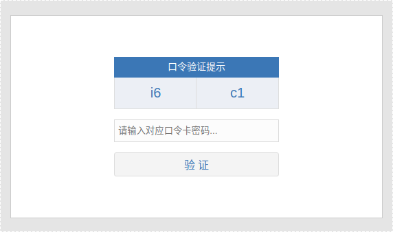
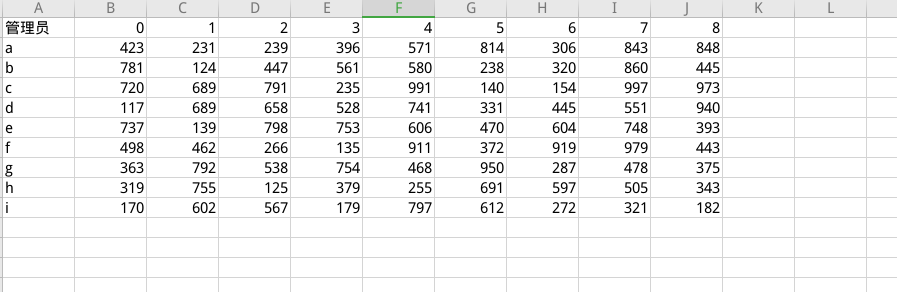

#### 需求

- 需要给每个账号导出密保卡，每个账号的密保卡应该是不一样的

- 账号登录成功后跳转到密保卡页面，根据坐标填写相应的值进行验证，验证通过才可以进入后台系统

- 适合管理员登录场景

#### 实现
> 原理

允许自定义的配置值：
```
length 横纵坐标索引数 默认9
is_upper 横向索引是否大写 默认true
num 坐标值长度 默认3
key 横向索引名，每个字符应该是唯一的 默认abcdefghilkmnopqrstuvwxyz
```

1. 需要生成'a' => [101, 222, 3, 4, 5],'b' => [1, 202, 345, 47, 5]类似的坐标轴数据
```
$result = [];
for ($i = 0; $i < $this->length; $i++) {
    //横坐标字母
    $code = $this->key[$i];

    //纵坐标数字，从0开始
    for ($j = 0; $j < $this->length; $j++) {
        //坐标值
        $rand_num = $this->get_rand_num();
        $result[$code][$j] = $rand_num;
    }
}
```

2. 创建坐标
```
 return [
            $this->key[rand(0, $this->length)],
            rand(0, $this->length),
            $this->key[rand(0, $this->length)],
            rand(0, $this->length)
        ];
```

3. 验证合法性
```
if (!preg_match('/^([A-Za-z]\d+){2}$/', $code)) {
    $this->err = '参数code规则不匹配';
    return false;
}

$flag = preg_match_all('/([A-Za-z]\d+)/', $code, $matches);
if (!$flag) {
    $this->err = '参数code规则不匹配';
    return false;
}

if (strlen($input) != ($this->num) * 2) {
    $this->err = '参数input规则不匹配';
    return false;
}

//坐标
$coordinate_1 = mb_substr($matches[0][0], 0, 1, 'utf-8');
$coordinate_1_1 = mb_substr($matches[0][0], 1, mb_strlen($matches[0][0]), 'utf-8');
$coordinate_2 = mb_substr($matches[1][1], 0, 1, 'utf-8');
$coordinate_2_1 = mb_substr($matches[1][1], 1, mb_strlen($matches[1][1]), 'utf-8');

if($this->is_upper){
    $coordinate_1 = strtoupper($coordinate_1);
    $coordinate_2 = strtoupper($coordinate_2);
}

if (!isset($keys[$coordinate_1][$coordinate_1_1]) || !isset($keys[$coordinate_2][$coordinate_2_1])) {
    $this->err = '参数code不存在';
    return false;
}

//对比结果
if ($input == $keys[$coordinate_1][$coordinate_1_1] . $keys[$coordinate_2][$coordinate_2_1])
    return true;

return false;
```

> 使用

```
$card = new SecurityCard();
//生成密保卡，之后应该生成xls文件并映射uid和文件的关系
$keys = $card->create();

//密保卡坐标
$info = implode('', $card->entry());

//post用户输入的表单值
$input = '232301';

//检查是否正确
$flag = $card->check($keys, $info, $input);

var_dump($keys, $info, $flag);
```

[代码](../../../../SHPhp/tree/master/system/Library/SecurityCard.class.php)

#### 效果

