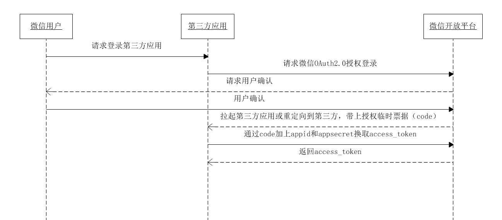

#### 简介

简单说，OAuth 就是一种授权机制。数据的所有者告诉系统，同意授权第三方应用进入系统，获取这些数据。系统从而产生一个短期的进入令牌（token），用来代替密码，供第三方应用使用

OAuth 的核心就是向第三方应用颁发令牌，OAuth 2.0 规定了四种获得令牌的流程

下面就是这四种授权方式：

- 授权码（authorization-code）

- 隐藏式（implicit）

- 密码式（password）

- 客户端凭证（client credentials）

不管哪一种授权方式，第三方应用申请令牌之前，都必须先到系统备案，说明自己的身份，然后会拿到两个身份识别码：客户端 ID（client ID）和客户端密钥（client secret）。这是为了防止令牌被滥用，没有备案过的第三方应用，是不会拿到令牌的

微信授权登录使用的就是授权码的方式，本文也主要说的就是这种方式的逻辑

#### 微信 OAuth2.0 授权流程

微信 OAuth2.0 授权登录让微信用户使用微信身份安全登录第三方应用或网站，在微信用户授权登录已接入微信 OAuth2.0 的第三方应用后，第三方可以获取到用户的接口调用凭证（access_token），通过 access_token 可以进行微信开放平台授权关系接口调用，从而可实现获取微信用户基本开放信息和帮助用户实现基础开放功能等

微信 OAuth2.0 授权登录目前支持 authorization_code 模式，适用于拥有 server 端的应用授权。该模式整体流程为：

```
1. 第三方发起微信授权登录请求，微信用户允许授权第三方应用后，微信会拉起应用或重定向到第三方网站，并且带上授权临时票据code参数；

2. 通过code参数加上AppID和AppSecret等，通过API换取access_token；

3. 通过access_token进行接口调用，获取用户基本数据资源或帮助用户实现基本操作。
```

#### 授权过程

1. 获取 CODE

A 网站提供一个链接，用户点击后就会跳转到 B 网站，授权用户数据给 A 网站使用
```
https://b.com/oauth/authorize?
  response_type=code&
  client_id=CLIENT_ID&
  redirect_uri=CALLBACK_URL&
  scope=read
```

response_type参数表示要求返回授权码（code），client_id参数让 B 知道是谁在请求，redirect_uri参数是 B 接受或拒绝请求后的跳转网址，scope参数表示要求的授权范围（这里是只读）

用户跳转后，B 网站会要求用户登录，然后询问是否同意给予 A 网站授权,这时 B 网站就会跳回redirect_uri参数指定的网址。跳转时，会传回一个授权码

```
https://a.com/callback?code=AUTHORIZATION_CODE
```

一个code只能成功换取一次access_token即失效，code的临时性和一次保障了微信授权登录的安全


2. 通过 CODE 获取 ACCESS_TOKEN

A 网站拿到授权码以后，就可以在后端，向 B 网站请求令牌

```
https://b.com/oauth/token?
 client_id=CLIENT_ID&
 client_secret=CLIENT_SECRET&
 grant_type=authorization_code&
 code=AUTHORIZATION_CODE
```
client_id参数和client_secret参数用来让 B 确认 A 的身份（client_secret参数是保密的，因此只能在后端发请求），grant_type参数的值是AUTHORIZATION_CODE，表示采用的授权方式是授权码，code参数是上一步拿到的授权码

3. B 网站收到请求以后，就会颁发令牌，返回一段 JSON 数据
 
B 网站颁发令牌的时候，一次性颁发两个令牌，一个用于获取数据，另一个用于获取新的令牌（refresh token 字段）。令牌到期前，用户使用 refresh token 发一个请求，去更新令牌

```
{    
  "access_token":"ACCESS_TOKEN",
  "token_type":"bearer",
  "expires_in":2592000,
  "refresh_token":"REFRESH_TOKEN",
  "scope":"read",
  "uid":100101,
  "info":{...}
}
```

access_token 字段就是令牌， refresh_token 用于更新 access_token 的令牌


令牌到期前，用户使用 refresh token 发一个请求，去更新令牌
```
https://b.com/oauth/token?
  grant_type=refresh_token&
  client_id=CLIENT_ID&
  client_secret=CLIENT_SECRET&
  refresh_token=REFRESH_TOKEN
```

参考微信官方流程图：



https://developers.weixin.qq.com/doc/oplatform/Mobile_App/WeChat_Login/Development_Guide.html