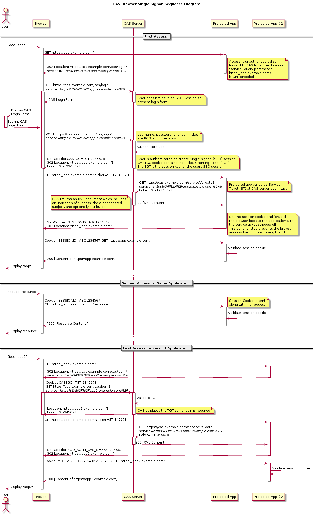

#### 简介

单点登录英文全称 Single Sign On，简称就是 SSO

在多个应用系统中，只需要登录一次，就可以访问其他相互信任的应用系统

#### 实现方式

> 同域下的单点登录

有且只有一个域名，通过二级域名区分不同的站点，比如 www.sk.com 、user.sk.com 、seller.sk.com，单点登录的站点为 login.sk.com，我们需要在 login.sk.com 登录成功后，所有的站点就也登录了

针对这个问题，我们可以在 login.sk.com 站点登录成功后将 Cookie 的域设置为顶域，即 .sk.com ，每个站点的 Session 就达到共享的目的了

> 通过 P3P 头实现跨域设置 Cookie

这种方式就不限制只能是一个域名了，可能是 www.taobao.com ，另外一个可能是 www.tmall.com

在A站点登录成功后在页面加入一行 Javascript 通知B站点同步登录，例如
```
<script type="text/javascript" src="http://login.sk.com/sign_on?source=1&uid=10&token=8bc22c2f-fd4b-4b7b-b42d-8b62c85032b7"></script>
```

B站点需要提供可以跨域设置 Cookie 的权限，通过解析令牌成功后同步登录并写入 Cookie

```
header('P3P:CP="IDC DSP COR ADM DEVi TAIi PSA PSD IVAi IVDi CONi HIS OUR IND CNT"');

setcookie ( COOKIE_NAME, $cookie, 0, '/', COOKIE_DOMAIN, NULL, FALSE );
```

> CAS 方式

官方流程图：


流程说明：

- 用户访问app系统，app系统是需要登录的，但用户现在没有登录，被重定向到 CAS Server 登录系统

请求地址如下：
```
https://cas.example.com/cas/login?service=https://app.example.com
```

-  CAS Server 系统也没有登录，弹出用户登录页，用户填写用户名、密码，SSO系统进行认证后，将登录状态写入 Session，浏览器中写入 CAS Server 域下的 Cookie

-  CAS Server 登录完成后会生成一个 Ticket ，然后跳回到app系统，同时 Ticket 将作为参数传递给app系统

请求地址如下：
```
https://app.example.com?ticket=ST-12345678
```

- app系统拿到 Ticket 后，从后台向 CAS Server 发送请求，验证 Ticket 是否有效

请求地址如下：
```
https://cas.example.com/serviceValidate?service=https://app.example.com?ticket=ST-12345678
```

-  CAS Server 系统验证通过后返回用户信息，app系统将登录状态写入 Session 并设置app域下的 Cookie


同理访问 https://app2.example.com 系统也是一样的逻辑，因为在 CAS Server 已经登录成功并创建了会话，因此直接跳转回去

请求地址如下：
```
https://app2.example.com?ticket=ST-12345678
```

CAS Server 系统应该注意：

1. 需要验证站点来源是否合法，可以对 URL 参数按规定的算法进行签名

2. 需要验证 Ticket 的合法性，是否过期，是否已经使用过（类似邮箱账号激活）

可参考使用 JWT 的方式进行验证 


