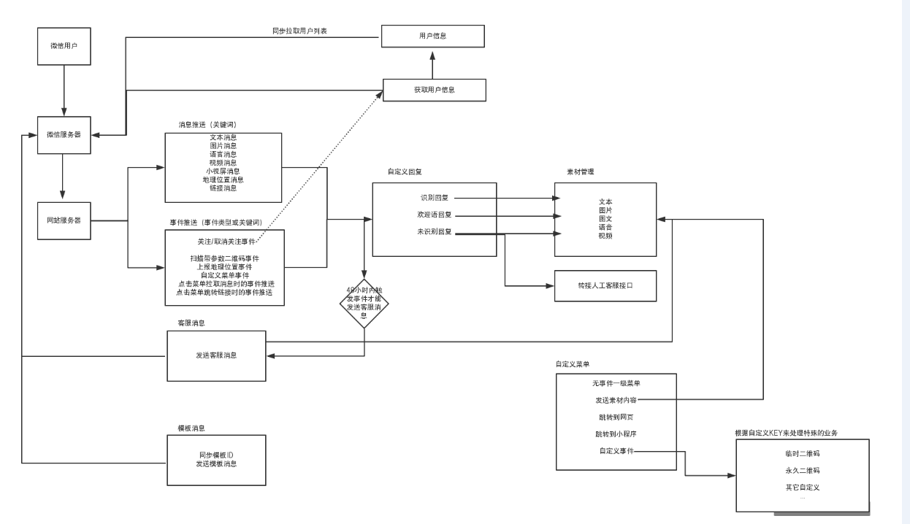
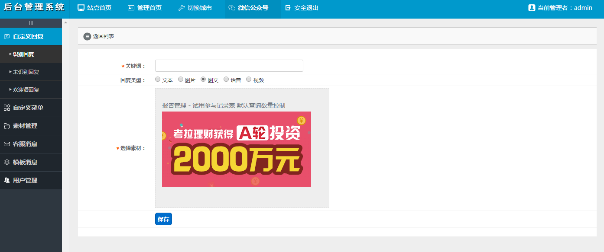
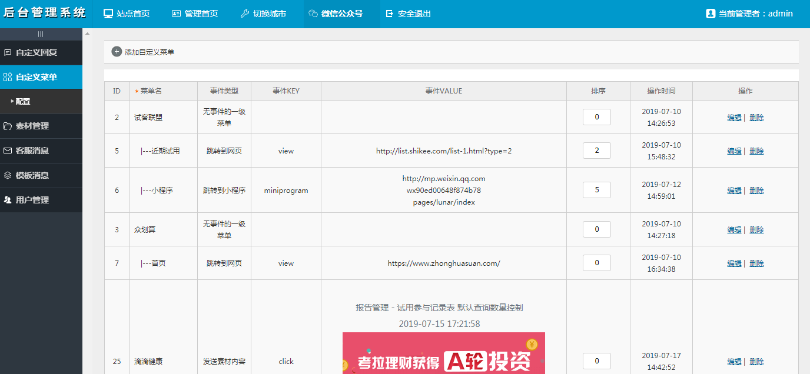
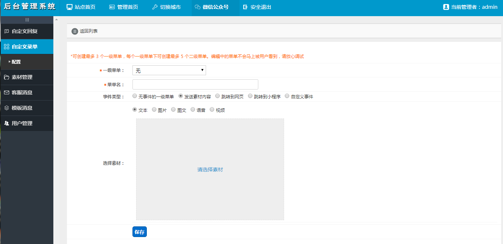
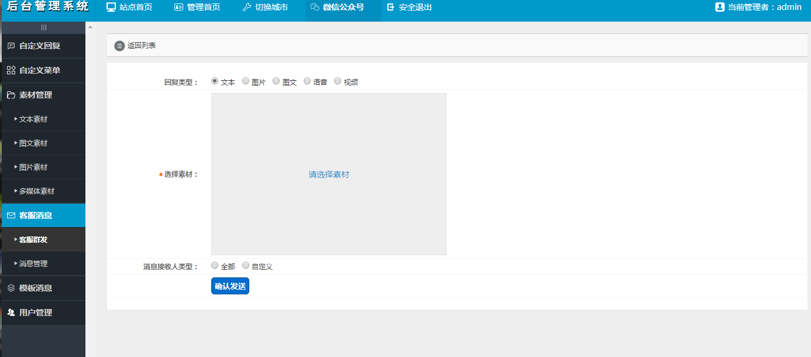
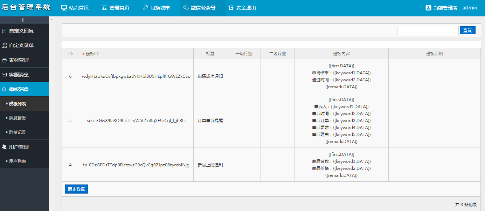
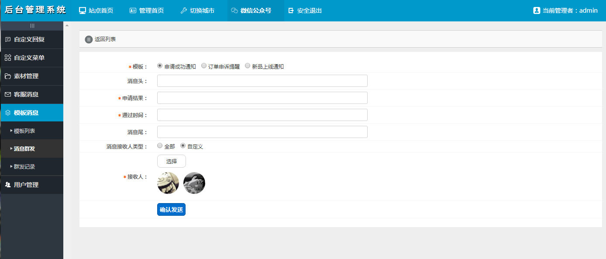
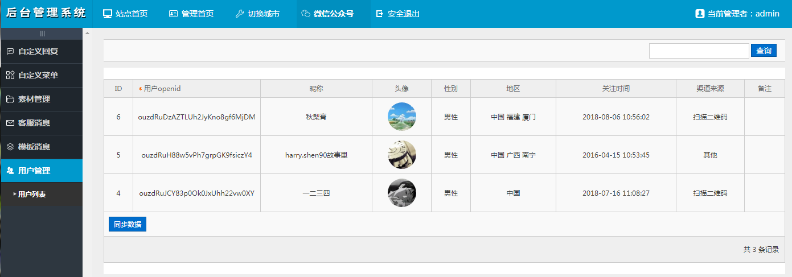

### 简介

环境： 

Centos7下使用Docker环境(php7.3 + mysql5.7.24 + nginx1.15.7)

php框架

Thinkphp3.2.3


### 功能说明

1.1、自定义回复

识别回复、未识别回复：

根据用户发送的内容作为关键词匹配回复消息，当匹配不到内容时可以使用客服转接功能；

欢迎语回复：

用户关注公众号推送的事件类型，可以回复消息给微信用户，同时会根据用户的openid获取用户信息，并保存下来；

1.2、自定义菜单

菜单类型包含：

无事件的一级菜单

发送素材内容（使用素材）

跳转到网页

跳转到小程序

自定义事件

1.3、素材管理

素材类型包含：

文本

图片

图文

语言

视频

1.4、客服消息

发送素材内容（使用素材）

模板消息

同步模板ID

发送模板消息

1.5、用户管理

同步用户列表


### 功能图解




### 功能效果图















### 数据结构

```
CREATE TABLE IF NOT EXISTS `mp_account` (
  `id` int(10) unsigned NOT NULL AUTO_INCREMENT COMMENT '主键',
  `name` varchar(50) NOT NULL DEFAULT '' COMMENT '公众号名称',
  `origin_id` varchar(32) NOT NULL DEFAULT '' COMMENT '公众号原始id',
  `type` tinyint(3) unsigned NOT NULL DEFAULT '0' COMMENT '公众号类型：1订阅号 2服务号',
  `appid` varchar(32) NOT NULL DEFAULT '' COMMENT 'AppID',
  `appsecret` varchar(255) NOT NULL DEFAULT '' COMMENT 'AppSecret',
  `is_safe_mode` tinyint(1) unsigned NOT NULL DEFAULT '0' COMMENT '是否为安全加密模式',
  `encodingaeskey` varchar(32) NOT NULL DEFAULT '' COMMENT 'EncodingAESKey',
  `dateline` int(10) unsigned NOT NULL DEFAULT '0' COMMENT '操作时间',
  PRIMARY KEY (`id`)
) ENGINE=InnoDB DEFAULT CHARSET=utf8 COMMENT='公众号 - 公众号账号';
```

```
CREATE TABLE IF NOT EXISTS `mp_account_operating` (
  `id` int(10) unsigned NOT NULL AUTO_INCREMENT COMMENT '主键',
  `aid` int(10) unsigned NOT NULL DEFAULT '0' COMMENT '公众号ID',
  `uid` int(10) unsigned NOT NULL DEFAULT '0' COMMENT '用户ID',
  `dateline` int(10) unsigned NOT NULL DEFAULT '0' COMMENT '操作时间',
  PRIMARY KEY (`id`),
  UNIQUE KEY `index_aid_uid` (`aid`,`uid`)
) ENGINE=InnoDB DEFAULT CHARSET=utf8 COMMENT='公众号 - 后台管理用户关联';
```

```
CREATE TABLE IF NOT EXISTS `mp_auto_reply` (
  `id` int(10) unsigned NOT NULL AUTO_INCREMENT COMMENT '主键',
  `aid` int(10) unsigned NOT NULL DEFAULT '0' COMMENT '公众号ID',
  `type` tinyint(3) unsigned NOT NULL DEFAULT '0' COMMENT '消息类型：1识别的关键词消息  2未识别关键词消息 3关注时欢迎语消息',
  `is_customer_service` tinyint(1) unsigned NOT NULL DEFAULT '0' COMMENT '是否转人工客服',
  `keyword` varchar(50) NOT NULL DEFAULT '' COMMENT '关键词',
  `msg_type` tinyint(3) unsigned NOT NULL DEFAULT '0' COMMENT '回复类型：1文本 2图片 3图文 4语言 5视频',
  `msg_value` int(10) unsigned NOT NULL DEFAULT '0' COMMENT '回复内容 素材ID',
  `dateline` int(10) unsigned NOT NULL DEFAULT '0' COMMENT '操作时间',
  PRIMARY KEY (`id`),
  UNIQUE KEY `index_aid_type_keyword` (`aid`,`type`,`keyword`)
) ENGINE=InnoDB DEFAULT CHARSET=utf8 COMMENT='公众号 - 自动回复';
```

```
CREATE TABLE IF NOT EXISTS `mp_event_log` (
  `id` int(10) unsigned NOT NULL AUTO_INCREMENT COMMENT '主键',
  `aid` int(10) unsigned NOT NULL DEFAULT '0' COMMENT '公众号ID',
  `openid` varchar(32) NOT NULL DEFAULT '' COMMENT '用户openid',
  `dateline` int(10) unsigned NOT NULL DEFAULT '0' COMMENT '操作时间',
  PRIMARY KEY (`id`),
  KEY `index_aid_openid` (`aid`,`openid`)
) ENGINE=InnoDB DEFAULT CHARSET=utf8 COMMENT='公众号 - 事件操作记录';
```

```
CREATE TABLE IF NOT EXISTS `mp_material_file` (
  `id` int(10) unsigned NOT NULL AUTO_INCREMENT COMMENT '主键',
  `aid` int(10) unsigned NOT NULL DEFAULT '0' COMMENT '公众号ID',
  `type` tinyint(3) unsigned NOT NULL DEFAULT '0' COMMENT '文件类型：1音频 2视频',
  `title` varchar(100) NOT NULL DEFAULT '' COMMENT '标题',
  `intro` varchar(255) NOT NULL DEFAULT '' COMMENT '摘要',
  `url` varchar(255) NOT NULL DEFAULT '' COMMENT '本地URL',
  `dateline` int(10) unsigned NOT NULL DEFAULT '0' COMMENT '操作时间',
  PRIMARY KEY (`id`),
  KEY `index_aid` (`aid`)
) ENGINE=InnoDB DEFAULT CHARSET=utf8 COMMENT='公众号 - 文件素材（音频、视频）';
```

```
CREATE TABLE IF NOT EXISTS `mp_material_image` (
  `id` int(10) unsigned NOT NULL AUTO_INCREMENT COMMENT '主键',
  `aid` int(10) unsigned NOT NULL DEFAULT '0' COMMENT '公众号ID',
  `url` varchar(255) DEFAULT '' COMMENT '本地URL',
  `dateline` int(10) unsigned NOT NULL DEFAULT '0' COMMENT '操作时间',
  PRIMARY KEY (`id`),
  KEY `index_aid` (`aid`)
) ENGINE=InnoDB DEFAULT CHARSET=utf8 COMMENT='公众号 - 图片素材';
```

```
CREATE TABLE IF NOT EXISTS `mp_material_news` (
  `id` int(10) unsigned NOT NULL AUTO_INCREMENT COMMENT '主键',
  `aid` int(10) unsigned NOT NULL DEFAULT '0' COMMENT '公众号ID',
  `title` varchar(100) NOT NULL DEFAULT '' COMMENT '标题',
  `author` varchar(32) NOT NULL DEFAULT '' COMMENT '作者',
  `url` varchar(255) NOT NULL DEFAULT '' COMMENT '图片URL',
  `intro` varchar(255) NOT NULL DEFAULT '' COMMENT '摘要',
  `content` text NOT NULL COMMENT '内容',
  `dateline` int(10) unsigned NOT NULL DEFAULT '0' COMMENT '操作时间',
  PRIMARY KEY (`id`),
  KEY `index_aid` (`aid`)
) ENGINE=InnoDB DEFAULT CHARSET=utf8 COMMENT='公众号 - 图文素材';
```

```
CREATE TABLE IF NOT EXISTS `mp_material_text` (
  `id` int(10) unsigned NOT NULL AUTO_INCREMENT COMMENT '主键',
  `content` text NOT NULL COMMENT '文本内容',
  `aid` int(10) unsigned NOT NULL DEFAULT '0' COMMENT '公众号ID',
  `dateline` int(10) unsigned NOT NULL DEFAULT '0' COMMENT '操作时间',
  PRIMARY KEY (`id`),
  KEY `index_aid` (`aid`)
) ENGINE=InnoDB DEFAULT CHARSET=utf8 COMMENT='公众号 - 文本素材';
```

```
CREATE TABLE IF NOT EXISTS `mp_media_id` (
  `id` int(10) unsigned NOT NULL AUTO_INCREMENT COMMENT '主键',
  `msg_type` tinyint(3) unsigned NOT NULL DEFAULT '0' COMMENT '回复类型：2图片  4语音 5视频',
  `msg_value` int(10) unsigned NOT NULL DEFAULT '0' COMMENT '回复内容 素材ID',
  `media_id` varchar(125) NOT NULL DEFAULT '' COMMENT '素材ID',
  `is_temporary` tinyint(3) unsigned NOT NULL DEFAULT '0' COMMENT '1临时素材 2永久素材',
  `dateline` int(10) unsigned NOT NULL DEFAULT '0' COMMENT '操作时间',
  PRIMARY KEY (`id`),
  KEY `index_msg_type_msg_value` (`msg_type`,`msg_value`)
) ENGINE=InnoDB DEFAULT CHARSET=utf8 COMMENT='公众号 - 素材media_id';
```

```
CREATE TABLE IF NOT EXISTS `mp_menu` (
  `id` int(10) unsigned NOT NULL AUTO_INCREMENT COMMENT '主键',
  `aid` int(10) unsigned NOT NULL DEFAULT '0' COMMENT '公众号ID',
  `pid` int(10) unsigned NOT NULL DEFAULT '0' COMMENT '一级菜单',
  `title` varchar(50) NOT NULL DEFAULT '' COMMENT '菜单名',
  `event_type` tinyint(3) unsigned NOT NULL DEFAULT '0' COMMENT '事件类型\r\n    1click拉取素材消息 2view菜单跳转 3scancode_push扫码事件 4scancode_waitmsg扫码推等待事件 5pic_sysphoto弹出系统拍照\r\n      6pic_photo_or_album发图事件  7pic_weixin弹出微信相册发图器的事件推送 8location_select弹出地理位置选择器的事件推送\r\n      9view_miniprogram 点击菜单跳转小程序的事件推送 10subscribe关注事件 11自定义事件(也是click事件)\r\n    ',
  `event_key` char(50) NOT NULL DEFAULT '' COMMENT '事件的key值 event_type:1时固定为text、news、pic',
  `event_value` varchar(255) NOT NULL DEFAULT '' COMMENT '事件关联的值，click推送事件文本text:1，小程序地址等',
  `sort` tinyint(3) unsigned NOT NULL DEFAULT '0' COMMENT '排序号',
  `dateline` int(10) unsigned NOT NULL DEFAULT '0' COMMENT '操作时间',
  PRIMARY KEY (`id`),
  KEY `index_aid_event_type_event_key_event_value` (`aid`,`event_type`,`event_key`,`event_value`)
) ENGINE=InnoDB DEFAULT CHARSET=utf8 COMMENT='公众号 - 自定义菜单';
```

```
CREATE TABLE IF NOT EXISTS `mp_message` (
  `id` int(10) unsigned NOT NULL AUTO_INCREMENT COMMENT '主键',
  `aid` int(10) unsigned NOT NULL DEFAULT '0' COMMENT '公众号ID',
  `msg_type` tinyint(3) unsigned NOT NULL DEFAULT '0' COMMENT '回复类型：1文本 2图片 3图文 4语言 5视频',
  `msg_value` int(10) unsigned NOT NULL DEFAULT '0' COMMENT '回复内容 素材ID',
  `dateline` int(10) unsigned NOT NULL DEFAULT '0' COMMENT '操作时间',
  `send_type` tinyint(3) unsigned NOT NULL DEFAULT '0' COMMENT '消息类型：1全部 2自定义',
  `remark` varchar(255) NOT NULL DEFAULT '' COMMENT '备注',
  PRIMARY KEY (`id`),
  KEY `index_aid` (`aid`)
) ENGINE=InnoDB DEFAULT CHARSET=utf8 COMMENT='公众号 - 消息回复';
```

```
CREATE TABLE IF NOT EXISTS `mp_message_log_user` (
  `id` int(10) unsigned NOT NULL AUTO_INCREMENT COMMENT '主键',
  `type` tinyint(3) unsigned NOT NULL DEFAULT '0' COMMENT '消息类型：1模板消息 2客服消息',
  `log_id` int(10) unsigned NOT NULL DEFAULT '0' COMMENT '消息记录ID',
  `openid` varchar(32) NOT NULL DEFAULT '' COMMENT '用户openid',
  `state` tinyint(3) unsigned NOT NULL DEFAULT '0' COMMENT '发送结果：1成功 2失败',
  `remark` varchar(255) NOT NULL DEFAULT '' COMMENT '备注',
  PRIMARY KEY (`id`),
  KEY `index_log_id` (`log_id`)
) ENGINE=InnoDB DEFAULT CHARSET=utf8 COMMENT='公众号 - 模板信息发送记录 - 用户';
```

```
CREATE TABLE IF NOT EXISTS `mp_template` (
  `id` int(10) unsigned NOT NULL AUTO_INCREMENT COMMENT '主键',
  `aid` int(10) unsigned NOT NULL DEFAULT '0' COMMENT '公众号ID',
  `template_id` varchar(80) NOT NULL DEFAULT '' COMMENT '模板ID',
  `title` varchar(32) NOT NULL DEFAULT '' COMMENT '标题',
  `primary_industry` varchar(32) NOT NULL DEFAULT '' COMMENT '所属行业的一级行业',
  `deputy_industry` varchar(32) NOT NULL DEFAULT '' COMMENT '所属行业的二级行业',
  `content` varchar(255) NOT NULL DEFAULT '' COMMENT '模板内容',
  `example` varchar(255) NOT NULL DEFAULT '' COMMENT '模板示例',
  PRIMARY KEY (`id`),
  UNIQUE KEY `index_aid_template_id` (`aid`,`template_id`)
) ENGINE=InnoDB DEFAULT CHARSET=utf8 COMMENT='公众号 - 模板信息';
```

```
CREATE TABLE IF NOT EXISTS `mp_template_log` (
  `id` int(10) unsigned NOT NULL AUTO_INCREMENT COMMENT '主键',
  `template_id` varchar(80) NOT NULL DEFAULT '' COMMENT '模板ID',
  `msg_type` tinyint(3) unsigned NOT NULL DEFAULT '0' COMMENT '消息类型：1全部 2自定义',
  `first` varchar(100) NOT NULL DEFAULT '' COMMENT '消息标题',
  `content` text NOT NULL COMMENT '消息内容',
  `footer` varchar(100) NOT NULL DEFAULT '' COMMENT '消息注脚',
  `remark` varchar(255) NOT NULL DEFAULT '' COMMENT '备注',
  `dateline` int(10) unsigned NOT NULL DEFAULT '0' COMMENT '操作时间',
  PRIMARY KEY (`id`),
  KEY `index_tid` (`template_id`)
) ENGINE=InnoDB DEFAULT CHARSET=utf8 COMMENT='公众号 - 模板信息发送记录';
```

```
CREATE TABLE IF NOT EXISTS `mp_user` (
  `id` int(10) unsigned NOT NULL AUTO_INCREMENT COMMENT '主键',
  `aid` int(10) unsigned NOT NULL DEFAULT '0' COMMENT '公众号ID',
  `subscribe` tinyint(1) unsigned NOT NULL DEFAULT '0' COMMENT '是否已经关注，没有的话其他信息是获取不到的',
  `openid` varchar(32) NOT NULL DEFAULT '' COMMENT '用户openid',
  `nickname` varchar(32) NOT NULL DEFAULT '' COMMENT '昵称',
  `sex` tinyint(1) unsigned NOT NULL DEFAULT '0' COMMENT '用户的性别，值为1时是男性，值为2时是女性，值为0时是未知',
  `city` varchar(32) NOT NULL DEFAULT '' COMMENT '用户所在城市',
  `country` varchar(32) NOT NULL DEFAULT '' COMMENT '用户所在国家',
  `province` varchar(32) NOT NULL DEFAULT '' COMMENT '用户所在省份',
  `language` varchar(32) NOT NULL DEFAULT '' COMMENT '用户的语言',
  `headimgurl` varchar(255) NOT NULL DEFAULT '' COMMENT '用户头像',
  `subscribe_time` varchar(32) NOT NULL DEFAULT '' COMMENT '用户关注时间',
  `unionid` varchar(32) NOT NULL DEFAULT '' COMMENT '只有在用户将公众号绑定到微信开放平台帐号后，才会出现该字段',
  `remark` varchar(32) NOT NULL DEFAULT '' COMMENT '公众号运营者对粉丝的备注',
  `groupid` tinyint(3) unsigned NOT NULL DEFAULT '0' COMMENT '用户openid',
  `subscribe_scene` varchar(32) NOT NULL DEFAULT '' COMMENT '返回用户关注的渠道来源，ADD_SCENE_SEARCH 公众号搜索，ADD_SCENE_ACCOUNT_MIGRATION 公众号迁移，ADD_SCENE_PROFILE_CARD 名片分享，ADD_SCENE_QR_CODE 扫描二维码，ADD_SCENEPROFILE LINK 图文页内名称点击，ADD_SCENE_PROFILE_ITEM 图文页右上角菜单，ADD_SCENE_PAID 支付后关注，ADD_SCENE_OTHERS 其他',
  `dateline` int(10) unsigned NOT NULL DEFAULT '0' COMMENT '操作时间',
  PRIMARY KEY (`id`),
  UNIQUE KEY `index_aid_openid` (`aid`,`openid`)
) ENGINE=InnoDB DEFAULT CHARSET=utf8 COMMENT='公众号 - 文本素材';
```

```
CREATE TABLE `mp_access_token` (
	`id` INT(10) NOT NULL AUTO_INCREMENT COMMENT 'ID编号',
	`aid` INT(10) UNSIGNED NOT NULL DEFAULT '0' COMMENT '公众号ID',
	`access_token` VARCHAR(512) NOT NULL DEFAULT '' COMMENT '验证码',
	`dateline` INT(10) NOT NULL DEFAULT '0' COMMENT '操作时间',
	`expire_time` INT(10) NOT NULL DEFAULT '0' COMMENT '过期时间',
	PRIMARY KEY (`id`),
	INDEX `index_aid` (`aid`)
)
COMMENT='微信公众号- access_token'
COLLATE='utf8_general_ci'
ENGINE=InnoDB;
```

