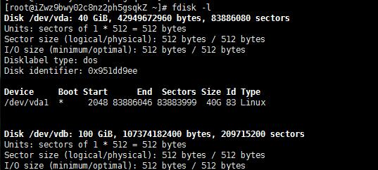
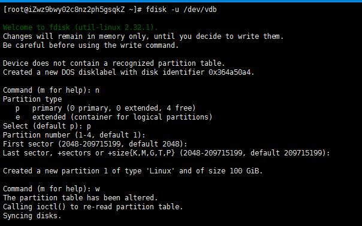
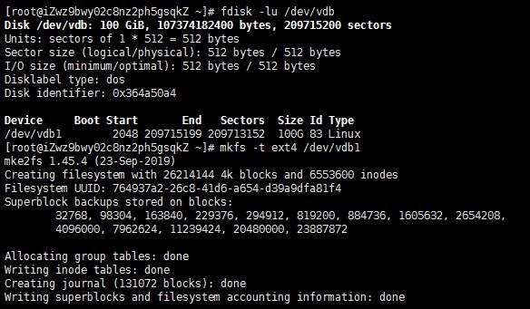
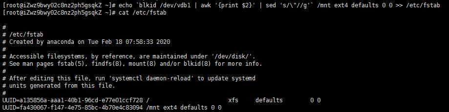
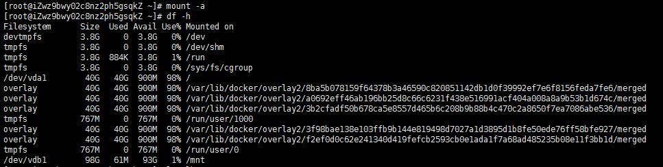

#### 为数据盘创建MBR分区

> 查看数据盘信息

fdisk -l



/dev/vd*为待挂载的磁盘，本示例中为/dev/vdb

> 对/dev/vdb进行分区操作

fdisk -u /dev/vdb





步骤输入：n => p => 回车 => 回车 =》 回车 =》 w

```
      输入“n”，新建分区

 2、Select (default p): 

      磁盘有两种分区类型： "p”表示主要分区，"e”表示延伸分区。可以直接“enter”，默认p

 3、Partition Number (1-4, default 1): 

      “Partition number”表示主分区编号，可以选择1-4。可以直接“enter”，默认1

 4、First sector (2048-209715199, default 2018): 

      “First sector”表示初始磁柱区域，可以选择2048-20971519。可以直接“enter”，默认为2048

 5、Last sector， +sectors or ...: 

      “Last sector”表示截止磁柱区域，可以选择2048-209715199。可以直接“enter”，默认为209715199

 6、Command (m for help): 输入w

      输入“p”，查看新建分区的详细信息

      输入“w”，将分区结果写入分区表中，分区完成

```

#### 为分区创建文件系统

运行以下命令，创建一个ext4文件系统。

```
mkfs -t ext4 /dev/vdb1
```

#### 挂载分区

```
备份/etc/fstab文件
cp /etc/fstab /etc/fstab.bak

写入fstab
echo `blkid /dev/vdb1 | awk '{print $2}' | sed 's/\"//g'` /mnt ext4 defaults 0 0 >> /etc/fstab

其中：
/dev/vdb1：已创建好文件系统的数据盘分区，您需要根据实际情况修改对应的分区名称。
/mnt：挂载（mount）的目录节点，您需要根据实际情况修改。
ext4：分区的文件系统类型，您需要根据创建的文件系统类型修改。

查看/etc/fstab中的新分区信息。
cat /etc/fsta

挂载/etc/fstab配置的文件系统。
mount -a

检查挂载结果。
df -h

```





